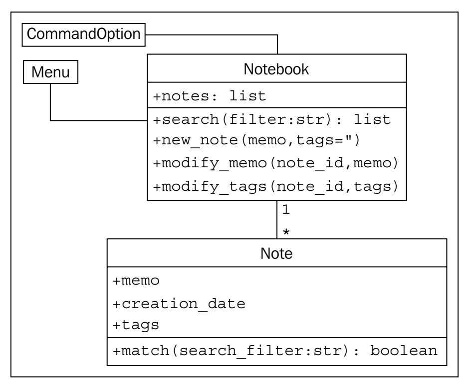

# Comand-line Notebook

## description

This application is the case study of chapter 2 of the book _"Python 3 Object-Oriented Programming"_ by Dusty Phillips. The case study is about a simple command-line notebook application.

## How to use this document

This document is following the first chapter convention, in which, the application should pass through the following steps:

1. **Analysis (OOA)**: Understand the problem and define the requirements.
2. **Design (OOD)**: The design of the application, including the classes and methods that will be implemented.
3. **Implementation (OOP)**: The implementation of the classes and methods.

## Table of contents

- [Analysis](#analysis)
- [Design](#design)
  - [The Classes Design](#the-classes-design)
  - [The Diagram](#the-diagram)
  - [The Folder Structure](#the-folder-structure)
- [Implementation](#implementation)
  - [notebook.py](#notebookpy)
    - [Initial implementation](#initial-implementation)
    - [Refactorying 1](#refactorying-1)
  - [menu.py](#menupy)
    - [Refactorying 2](#refactorying-2)

## [Analysis](#table-of-contents)

- **notes** are short memos stored in a notebook.
- Each **note** should record the day it was written.
- Each **note** can have tags for easy querying.
- _modify_ **notes**
- _search_ **notes**
- Finally, all of this must be done in the command-line.

## [Design](#table-of-contents)

### [The Classes Design](#table-of-contents)

- **Note** class
  - **attributes**
    - **id**: a unique identifier for the note.
    - **memo**: a string representing the content of the note.
    - **creation_date**: the data at which this note is created.
    - **tags**: a comma-separated string.
  - **methods**
    - **\_\_str\_\_**: return the note content.
    - **match**: return True if the note matches a search filter.
- **Notebook** class

  - **attributes**
    - **notes**: a list of notes.
  - **methods** - **new_note**: create a new note. - **modify_memo**: modify the memo of a note. - **modify_tags**: modify the tags of a note. - **search**: search for a note.

### [The Diagram](#table-of-contents)

Here is a diagram of the classes and their relationships:


As we can see, the application should have two interfaces, one is _menu_ and the other is _command line_.

- The _menu_ interface is a simple text-based menu that allows the user to select an option.
- The _command line_ interface allows the user to enter commands directly. The _menu_ interface will be implemented first, and then the _command line_ interface will be implemented.

  > **Note**: As a design decision, we'll implement the menu interface now, but will keep the
  > command-line options version in mind to ensure we design our Notebook class with
  > extensibility in mind.

### [The Folder Structure](#table-of-contents)

```plaintext
parent_directory
├── notebook.py
├── menu.py
└── command_option.py
```

- **notebook.py**: This file contains the implementation of the Notebook class and the Note class.
- **menu.py**: This file contains the implementation of the menu interface.
- **command_option.py**: This file contains the implementation of the command line interface. It can help remind us in the future that we were planning to add new user interfaces.

## [Implementation](#table-of-contents)

### [notebook.py](#table-of-contents)

#### [Initial implementation](#table-of-contents)

```python
"""notebook.py
In this module, we define the Notebook and Note classes.
The Notebook class is responsible for managing a list of notes, while the Note class represents an individual note with its content, creation date, and tags.
"""


import datetime


# Store the next available id for all new notes
next_id = 0

class Note:
    """
    Represent a note in the notebook.
    Match against a string in searches and store tags for each note.
    """

    def __init__(self, memo, tags=''):
        """
        initialize a note with memo and optional space-separtated tags.
        Automatically set the note's creation date and a unique id.
        """

        self.memo = memo
        self.tags = tags
        self.creation_date = datetime.date.today()
        global last_id
        last_id += 1
        self.id = last_id

    def match(self, filter):
        """
        Determine if this note matches the filter text.
        Return True if it matches, False otherwise.
        Search is case sensitive and matches both text and tags.
        """

        return filter in self.memo or filter in self.tags
```

Before we continue, let's test the Note class to make sure it works as expected.

```bash
python -i notebook.py
```

```python
>>> from notebook import Note
>>> n1 = Note("hello first")
>>> n2 = Note("hello again")
>>> n1.id
# 1
>>> n2.id
# 2
>>> n1.match('hello')
# True
>>> n2.match('second')
# False
```

```python
# notebook.py
class Notebook:
    """Represent a collection of notes that can be tagged,
    modified, and searched."""

    def __init__(self):
        """Initialize a notebook with an empty list."""

        self.notes = []

    def new_note(self, memo, tags=""):
        """Create a new note and add it to the list."""

        self.notes.append(Note(memo, tags))

    def modify_memo(self, note_id, memo):
        """Find the note with the given id and change its
        memo to the given value."""

        for note in self.notes:
            if note.id == note_id:
                note.memo = memo
                break

    def modify_tags(self, note_id, tags):
        """Find the note with the given id and change its
        tags to the given value."""

        for note in self.notes:
            if note.id == note_id:
                note.tags = tags
                break

    def search(self, filter):
        """Find all notes that match the given filter
        string."""

        return [note for note in self.notes if note.match(filter)]

```

Before we continue, let's test the Note class to make sure it works as expected.

```bash
python -i notebook.py
```

```python
>>> from notebook import Note, Notebook
>>> n = Notebook()
>>> n.new_note("hello world")
>>> n.new_note("hello again")
>>> n.notes
# [<notebook.Note object at 0x.......>, <notebook.Note object at 0x.......>]
>>> n.notes[0].id
# 1
>>> n.notes[1].id
# 2
>>> n.notes[0].memo
# 'hello world'
>>> n.search("hello")
# [<notebook.Note object at 0x.......>, <notebook.Note object at 0x........>]
>>> n.search("world")
# [<notebook.Note object at 0xb730a78c>]
>>> n.modify_memo(1, "hi world")
>>> n.notes[0].memo
# 'hi world'
```

#### [Refactorying 1](#table-of-contents)

are trying to identify the note with a given ID before doing something to that note. So, let's add a method to locate the note with a specific ID.

```python
# notebook.py

def _find_note(self, note_id):  # private method
    """Locate the note with the given id."""
    for note in self.notes:
        if note.id == note_id:
        return note
    return None

def modify_memo(self, note_id, memo):
    """Find the note with the given id and change its
    memo to the given value."""

    self._find_note(note_id).memo = memo
```

### [menu.py](#table-of-contents)

```python
import sys

from notebook import Notebook, Note


class Menu:
    '''Display a menu and respond to choices when run.'''

    def __init__(self):
        """Initialize the menu by creating a Notebook instance and
        defining the available choices."""

        self.notebook = Notebook()
        self.choices = {
          "1": self.show_notes,
          "2": self.search_notes,
          "3": self.add_note,
          "4": self.modify_note,
          "5": self.quit
        }

    def display_menu(self):
        """Display the menu options."""

        print("""
        Notebook Menu
        1. Show all Notes
        2. Search Notes
        3. Add Note
        4. Modify Note
        5. Quit
        """)

    def run(self):
        """Display the menu and respond to choices."""
        while True:
          self.display_menu()
          choice = input("Enter an option: ")
          action = self.choices.get(choice)
          if action:
            action()
          else:
            print("{0} is not a valid choice".format(choice))

    def show_notes(self, notes=None):
        """
        Display `notes` in the notebook.
        If notes is None, show all notes in the notebook.
        """

        if not notes:
          notes = self.notebook.notes
        for note in notes:
          print("{0}: {1}\n{2}".format(note.id, note.tags, note.memo))

    def search_notes(self):
        """Search for notes that match a filter string."""

        filter = input("Search for: ")
        notes = self.notebook.search(filter)
        self.show_notes(notes)

    def add_note(self):
        """Add a new note to the notebook."""

        memo = input("Enter a memo: ")
        self.notebook.new_note(memo)
        print("Your note has been added.")

    def modify_note(self):
        id = input("Enter a note id: ")
        memo = input("Enter a memo: ")
        tags = input("Enter tags: ")
        if memo:
            self.notebook.modify_memo(id, memo)
        if tags:
            self.notebook.modify_tags(id, tags)

    def quit(self):
        """Exit the program."""

        print("Thank you for using your notebook today.")
        sys.exit(0)


if __name__ == "__main__":
    Menu().run()
```

#### [Refactorying 2](#table-of-contents)

If we test this code, we'll find that modifying notes doesn't work. There are two bugs, namely:

- The notebook crashes when we enter a note ID that does not exist. We should never trust our users to enter correct data!
- Even if we enter a correct ID, it will crash because the note IDs are integers, but our menu is passing a string.

```python
# notebook.py

def _find_note(self, note_id):
    """Locate the note with the given id."""

    for note in self.notes:
        if str(note.id) == str(note_id):
            return note
      return None

def modify_memo(self, note_id, memo):
    """
    Find the note with the given id and change its
    memo to the given value.
    """

    note = self._find_note(note_id)
    if note:
        note.memo = memo
        return True
    return False

```
